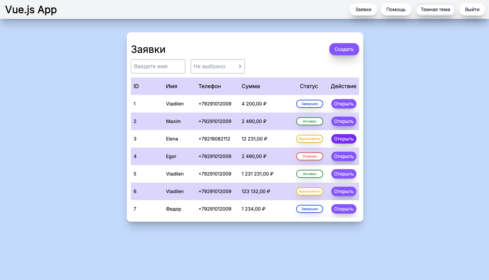
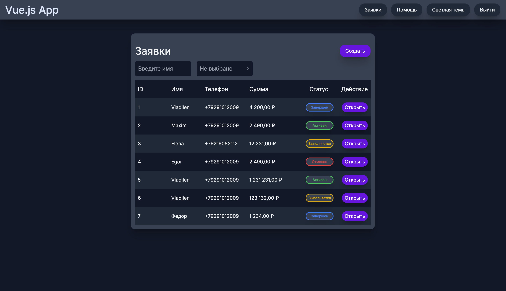

# 🌗 Vue Pet Project: Demo UI

> A frontend showcase with fake authorization, UI components, and hand-crafted dev setup.

🔗 [Live on Vercel](https://applications-management-system-vue3.vercel.app/)




---

## 🧰 Stack

- Vue 3 + Composition API
- Vue Router
- Pinia
- TypeScript
- Vite
- Tailwind CSS (dark/light themes)
- ESLint, Prettier
- GitHub Actions + Vercel

## ⚙️ Features

- Manual Vite setup
- Custom [UI framework](https://www.npmjs.com/package/@maikovskii-danil/ui-framework-vue)
- Manually configured ESLint + Prettier

## 🛠️ Environment

🖥️ Developed and tested on macOS/Linux (Chrome)

⚙️ Node.js: `22.17.0`  
📦 npm: `11.4.2`

❗ Windows is **not officially supported**

💡 However, you can try running it on Windows (just change `os` field in `package.json`):

```json
{
  "os": ["darwin", "linux", "win32"]
}
```

##### Then run `npm install`

## 🔐 Authorization

Fake login flow with mock credentials:

- Email: `some.user@automation.testing`
- Password: `123456`

## 🧪 Project Setup & Development

```sh
npm start
```

###### Runs `clean-install` before launch

## 🏗️ Production Build

```sh
npm run build
```

###### Also runs `clean-install` before building

## 🧃 Need help?

#### Feel free to reach out:

- maikovsky.danil@gmail.com
- Telegram: [@danilmaikovsky](https://t.me/danilmaikovsky)
